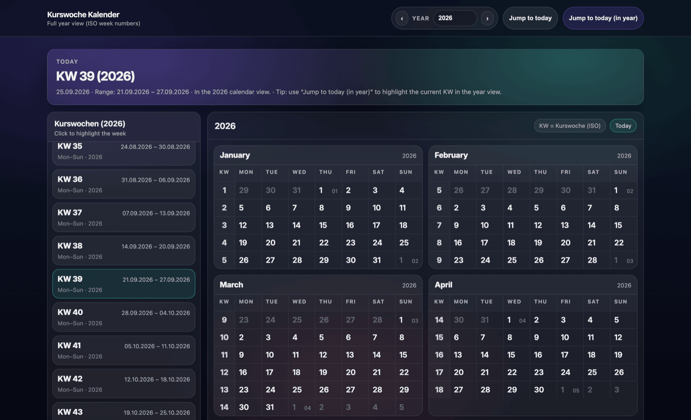

<div align="center">

# Kurswochen Kalender

**A full-year calendar that answers one question quickly: which week is it?**

[](https://github.com/kibotu/kurswochen-kalender/actions/workflows/deploy-pages.yml)
[](LICENSE)

[**Open the calendar →**](https://kibotu.github.io/kurswochen-kalender/)



</div>

---

## What this solves

"What KW are we in?" is a surprisingly frequent question — in a course schedule, a training plan, a shift roster — and the answer is rarely one click away. Most calendars bury the week number, and the ones that show it stop at the current year.

This page puts it front and centre: today's **Kurswoche** (KW) with its Monday–Sunday range, a full year of week numbers down the side, and every date laid out around them. Open it, and you know the week.

## Features

- **Today's KW card** — week number, week-year, and the exact Mon–Sun range, no scrolling required
- **Full-year view** — every month with its KW per week row; today is highlighted
- **Week sidebar** — all Kurswochen of the year, click to highlight a week across the calendar
- **Any year, not just this one** — step through years or type one; defaults to the current year
- **Jump to today** — two buttons: scroll to today's date, or highlight today's KW in the current year view
- **Shareable state** — the selected year lives in the URL (`?year=2026`) and in `localStorage`
- **Works offline** — a static page, self-hosted fonts, no analytics, no network calls

## Usage

No build step. Open `index.html` directly, or serve the folder:

```bash
python3 -m http.server 8080
```

Then visit `http://localhost:8080`.

Jump straight to a year with a query parameter:

```
index.html?year=2027
```

## How weeks are counted

`KW` here is the **ISO-8601 week number**: weeks run Monday–Sunday, and week 1 is the week containing the first Thursday of the year. That means a week can belong to a different year than its January dates — the card shows the week-year for exactly that reason.

We've tested around the year boundaries; if you find a date we get wrong, an issue is more useful than a guess.

## Deployment

Every push to `main` publishes the site to GitHub Pages via [`deploy-pages.yml`](.github/workflows/deploy-pages.yml). Pages must be enabled for the repository with **GitHub Actions** as the source.

## Fonts

The Inter variable font is self-hosted from [`fonts/`](fonts/); see [`fonts/README.md`](fonts/README.md) for details.

### Support

If this calendar saved you a click, a lookup, or an afternoon of counting weeks on your hands,
consider [buying me a coffee](https://buymeacoffee.com/kibotu).
